# HydroMart 2 — Dokumentasi Alur Fitur

Dokumen ini menjelaskan cara kerja **setiap fitur** di aplikasi HydroMart 2, dari interaksi pengguna di browser sampai penyimpanan database, integrasi API eksternal, email, dan kembali ke tampilan pengguna.

---

## Daftar Isi

1. [Gambaran Umum Sistem](#1-gambaran-umum-sistem)
2. [Arsitektur & Lapisan Teknis](#2-arsitektur--lapisan-teknis)
3. [Skema Database](#3-skema-database)
4. [Autentikasi & Otorisasi](#4-autentikasi--otorisasi)
5. [Halaman Publik](#5-halaman-publik)
6. [Fitur Pelanggan](#6-fitur-pelanggan)
7. [Fitur Admin](#7-fitur-admin)
8. [API & Integrasi Eksternal](#8-api--integrasi-eksternal)
9. [Email](#9-email)
10. [Scheduler (Background)](#10-scheduler-background)
11. [Diagram Status Transaksi](#11-diagram-status-transaksi)
12. [Referensi Route](#12-referensi-route)

---

## 1. Gambaran Umum Sistem

HydroMart 2 adalah aplikasi **e-commerce Laravel** untuk penjualan **produk fisik** dan **layanan**, dengan dua peran pengguna:

| Peran | Keterangan |
|-------|------------|
| `pelanggan` | Belanja, checkout, bayar, tracking, ulasan, reward |
| `admin` | Kelola produk, layanan, transaksi, reward, balas ulasan |

Alur bisnis utama pelanggan:

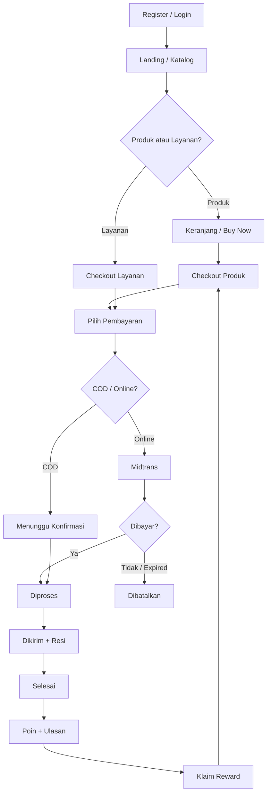

---

## 2. Arsitektur & Lapisan Teknis

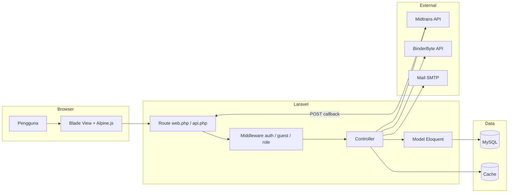

| Lapisan | Lokasi | Fungsi |
|---------|--------|--------|
| Route | `routes/web.php`, `routes/api.php` | Memetakan URL ke controller |
| Middleware | `auth`, `guest`, `role:admin\|pelanggan` | Proteksi akses |
| Controller | `app/Http/Controllers/` | Logika bisnis & validasi |
| Model | `app/Models/` | Relasi & operasi database |
| View | `resources/views/` | Tampilan HTML |
| Mail | `app/Mail/OtpMail.php` | Template email OTP |
| Config | `config/midtrans.php`, `config/services.php` | Kredensial API |

**Stack:** PHP 8.3, Laravel 13, MySQL, Midtrans SDK, BinderByte (tracking), SMTP (OTP), session-based auth.

---

## 3. Skema Database

### 3.1 Tabel Utama

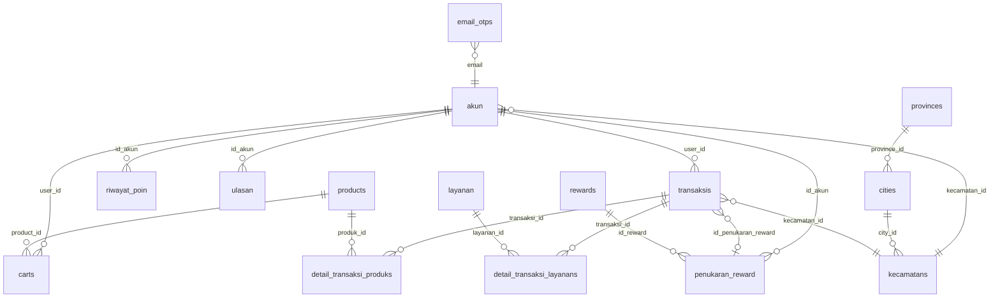

### 3.2 Ringkasan Tabel

| Tabel | Model | Keterangan |
|-------|-------|------------|
| `akun` | `User` | Akun admin & pelanggan (UUID primary key) |
| `provinces`, `cities`, `kecamatans` | `Province`, `City`, `Kecamatan` | Data wilayah + `ongkir` per kota |
| `products` | `Product` | Katalog produk (soft delete `is_delete`) |
| `layanan` | `Layanan` | Katalog layanan |
| `carts` | `Keranjang` | Item keranjang per user |
| `transaksis` | `Transaksi` | Header pesanan (`order_id` auto: `HM-YYYYMMDD-XXXXXXXX`) |
| `detail_transaksi_produks` | `DetailTransaksiProduk` | Item produk dalam transaksi |
| `detail_transaksi_layanans` | `DetailTransaksiLayanan` | Item layanan dalam transaksi |
| `rewards` | `Reward` | Master voucher diskon |
| `penukaran_reward` | `PenukaranReward` | Reward yang sudah diklaim pelanggan |
| `riwayat_poin` | `RiwayatPoin` | Log penambahan/pengurangan poin |
| `ulasan` | `Ulasan` | Rating & komentar + balasan admin |
| `email_otps` | `EmailOtp` | OTP reset password (expire 10 menit) |
| `sessions` | — | Session login Laravel |

---

## 4. Autentikasi & Otorisasi

### 4.1 Middleware

| Alias | Class | Perilaku |
|-------|-------|----------|
| `guest` | `RedirectIfAuthenticated` | User sudah login → redirect |
| `auth` | bawaan Laravel | Belum login → redirect ke `landing` |
| `role:admin` | `CheckRole` | Role harus `admin`, else redirect landing |
| `role:pelanggan` | `CheckRole` | Role harus `pelanggan` |

Konfigurasi di `bootstrap/app.php`:
- CSRF **diabaikan** untuk `api/midtrans/callback` (notifikasi server-to-server).
- Tamu (guest) diarahkan ke route `landing`.

Guard: `web` (session), provider model `User` pada tabel `akun`.

---

### 4.2 Registrasi Akun Pelanggan

**Route:** `GET/POST /register` (middleware `guest`)

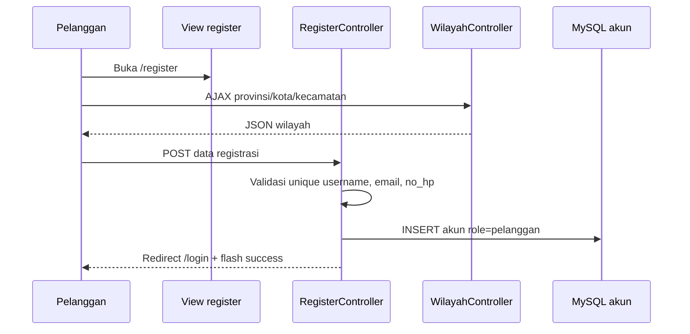

| Langkah | Detail |
|---------|--------|
| 1 | User mengisi username, password, nama, email, no_hp, alamat, provinsi/kota/kecamatan |
| 2 | Dropdown wilayah diisi via endpoint `/provinces`, `/cities/{id}`, `/kecamatan/{id}` |
| 3 | `RegisterController@register` validasi & `User::create()` |
| 4 | Password di-hash otomatis (cast `hashed` pada model) |
| 5 | `role` selalu `pelanggan`, `tanggal_bergabung` = now |
| 6 | Redirect ke halaman login |

**File:** `RegisterController.php`, view `auth/register.blade.php`

---

### 4.3 Login & Logout

**Route:** `GET/POST /login`, `POST /logout`

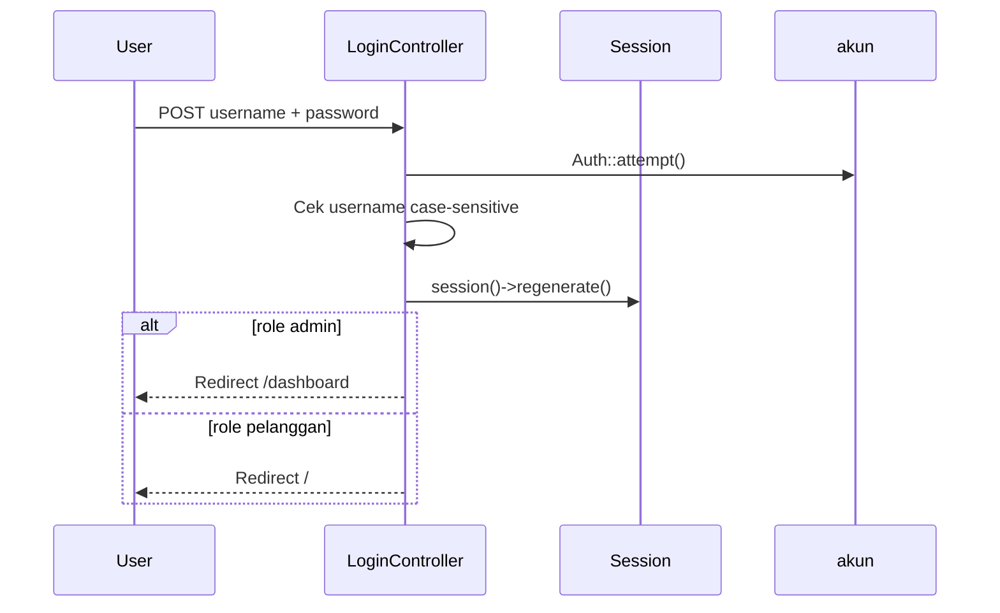

| Langkah | Detail |
|---------|--------|
| 1 | `Auth::attempt()` memverifikasi kredensial di tabel `akun` |
| 2 | Username dicek **case-sensitive** (jika hash cocok tapi case beda → logout + error) |
| 3 | Session di-regenerate untuk keamanan |
| 4 | Admin → `/dashboard`, Pelanggan → `/` (landing) |
| 5 | Logout: `Auth::logout()`, invalidate session, redirect `/` |

**File:** `LoginController.php`

---

### 4.4 Lupa Password (OTP Email)

**Route:** `/forgot-password`, `/reset-password` (guest)

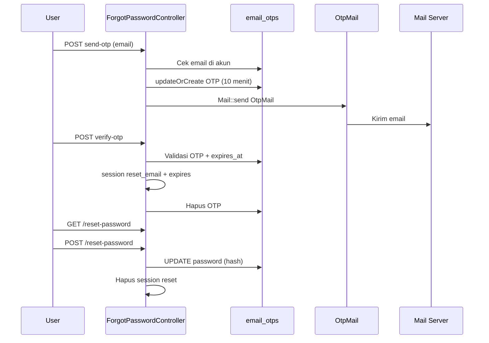

| Tahap | Endpoint | Aksi DB / Sistem |
|-------|----------|----------------|
| Minta OTP | `POST /forgot-password/send-otp` | Insert/update `email_otps` (type: `forgot_password`) |
| Verifikasi | `POST /forgot-password/verify-otp` | Cek OTP, buat session 10 menit, hapus OTP |
| Form reset | `GET /reset-password` | Gate: session `reset_email` harus ada |
| Simpan password | `POST /reset-password` | Update `akun.password`, clear session |

**Keamanan:**
- OTP 6 digit, berlaku 10 menit
- Session reset berlaku 10 menit
- Email pada form reset harus sama dengan session
- OTP dihapus setelah verifikasi (one-time use)

**File:** `ForgotPasswordController.php`, `OtpMail.php`, view `emails/otp.blade.php`

---

## 5. Halaman Publik

Halaman ini **tidak wajib login** (kecuali aksi belanja yang membutuhkan auth).

---

### 5.1 Landing Page

**Route:** `GET /` → `landing`

| Langkah | Detail |
|---------|--------|
| 1 | Jika user login sebagai **admin** → redirect `admin.dashboard` |
| 2 | Query 8 produk teratas (`is_delete=0`, stok habis di bawah, urut `total_terjual`) |
| 3 | Render `resources/views/landing.blade.php` |

---

### 5.2 Katalog Produk (Publik)

**Route:** `GET /produk`, `GET /produk/{slug}`

**Controller:** `ProductController`

| Fitur | Alur |
|-------|------|
| Index | Filter `search`, `category` → pagination 20 → view `produk.index` |
| Detail | Load produk by `slug`, ulasan aktif + user, produk terkait (kategori sama, max 4) → view `produk.show` |

**Database:** `products` WHERE `is_delete = 0`

**Aksi lanjutan (butuh login):** tombol "Tambah Keranjang" / "Beli Sekarang" → route pelanggan.

---

### 5.3 Katalog Layanan (Publik)

**Route:** `GET /layanan`, `GET /layanan/{slug}`

**Controller:** `LayananController`

Mirip produk: listing + detail dengan ulasan. Tidak ada keranjang; langsung ke checkout layanan.

---

### 5.4 Data Wilayah (Dropdown)

Wilayah dipakai di **registrasi**, **profil**, dan **checkout**.

#### Route Web (JSON)

| Endpoint | Method | Fungsi |
|----------|--------|--------|
| `/provinces` | GET | Semua provinsi (profil) |
| `/provinces-transaction` | GET | Provinsi terbatas (checkout produk) |
| `/cities/{provinceId}` | GET | Kota by provinsi |
| `/kecamatan/{cityId}` | GET | Kecamatan by kota |
| `/kecamatan-transaction/{cityId}` | GET | Kecamatan untuk transaksi |

#### Route API (`routes/api.php`)

| Endpoint | Fungsi |
|----------|--------|
| `GET /api/cities/{province_id}` | Kota |
| `GET /api/cities-transaction/{province_id}` | Kota (exclude Kepulauan Seribu) |
| `GET /api/districts/{city_id}` | Kecamatan |
| `GET /api/districts-transaction/{city_id}` | Kecamatan transaksi |

**Controller:** `WilayahController` → query `provinces`, `cities`, `kecamatans`

**Provinsi checkout produk (dibatasi):** Banten, DKI Jakarta, Jawa Barat, Jawa Tengah, DIY, Jawa Timur.

**Geofencing khusus:**
- Produk kategori **Sayuran** → hanya kecamatan: Sumbersari, Patrang, Kaliwates
- Layanan → hanya 3 kecamatan tersebut (Jember)

---

## 6. Fitur Pelanggan

Semua route di bawah middleware `auth` + `role:pelanggan`.

---

### 6.1 Profil Pengguna

**Route:** `/profile`, `/profile/edit`, `PUT /profile/update`, `PUT /profile/password`

**Controller:** `ProfileController`

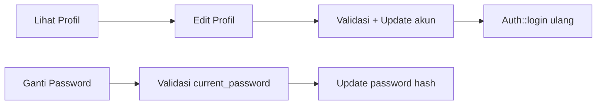

| Fitur | Validasi | DB |
|-------|----------|-----|
| Update profil | username, email, no_hp unique; wilayah exists | `UPDATE akun` |
| Update password | `current_password` + Password rules | `UPDATE akun.password` |

Dropdown wilayah sama seperti registrasi (`/provinces`, dll).

---

### 6.2 Keranjang Belanja

**Route:** `/keranjang` (CRUD)

**Controller:** `KeranjangController`

| Aksi | Route | Alur |
|------|-------|------|
| Lihat | `GET /keranjang` | `carts` WHERE `user_id` + relasi `product` |
| Tambah | `POST /keranjang/tambah` | Jika item sama → tambah qty; else insert baru. Cek stok |
| Update qty | `PATCH /keranjang/update/{cart}` | AJAX JSON, cek ownership + stok |
| Hapus | `DELETE /keranjang/hapus/{cart}` | Delete row |

**Tabel:** `carts` (`user_id`, `product_id`, `jumlah`)

---

### 6.3 Checkout Produk

**Route:** `GET /checkout`, `POST /checkout/store`, `GET /cek-ongkir`

**Controller:** `Pelanggan\TransaksiController`

#### 6.3.1 Tampilan Checkout (`checkout`)

Dua mode:

| Mode | Sumber Item |
|------|-------------|
| `buy_now` | Query `product_id` + `qty` dari URL/form |
| `cart` | `cart_ids[]` dari keranjang terpilih |

Alur persiapan:
1. Validasi stok setiap item
2. Hitung `grandTotal`, `totalWeight` (gram)
3. Deteksi `isSayuran` → batasi kecamatan Jember
4. Load reward tersedia (`penukaran_reward` status `Tersedia`, belum expired)
5. Render `pelanggan.transaksi.checkout.produk.index`

#### 6.3.2 Cek Ongkir (`cekOngkir`)

```
ongkir = 0  jika kecamatan ∈ {Patrang, Sumbersari, Kaliwates}
ongkir = city.ongkir × ceil(berat_gram / 1000)  untuk wilayah lain
```

Frontend memanggil endpoint ini via AJAX saat user memilih kecamatan.

#### 6.3.3 Simpan Pesanan (`store`)

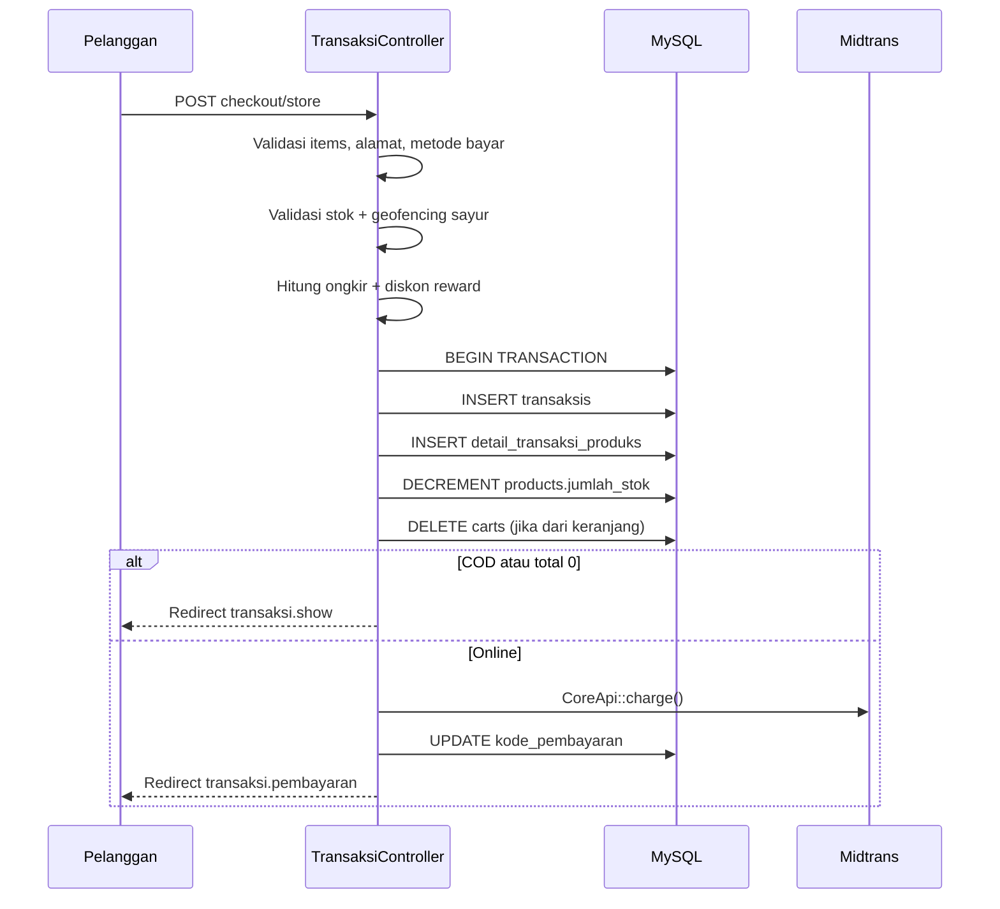

**Field transaksi yang disimpan:**

| Field | Nilai |
|-------|-------|
| `order_id` | Auto: `HM-YYYYMMDD-RANDOM8` (model boot) |
| `status` | `Menunggu Pembayaran` (online) / `Menunggu Konfirmasi` (COD atau total≤0) |
| `metode_pembayaran` | `qris`, `bca`, `mandiri`, `cod` |
| `poin` | `floor(total_setelah_diskon / 10000)` |
| `batas_pembayaran` | now + 24 jam |
| `ongkir` | Hasil `calculateOngkir()` |
| `id_penukaran_reward` | Opsional; jika valid → diskon & status reward → `Digunakan` |

**Metode pembayaran online → Midtrans:**

| Metode | Midtrans `payment_type` | Kode disimpan |
|--------|-------------------------|---------------|
| QRIS | `qris` | URL QR dari `actions` |
| BCA | `bank_transfer` (bank: bca) | VA number |
| Mandiri | `echannel` | JSON bill_key + biller_code |

---

### 6.4 Checkout Layanan

**Route:** `GET /checkout-layanan`, `POST /checkout-layanan/store`

Alur mirip produk, dengan perbedaan:

| Aspek | Layanan |
|-------|---------|
| Item | Satu `layanan_id` |
| Detail | `detail_transaksi_layanans` |
| Berat | Fixed 1000 gram |
| Geofencing | Wajib kecamatan Sumbersari/Patrang/Kaliwates |
| Poin | `floor(harga / 50000)` |
| Reward diskon | Tidak dipakai di checkout layanan |

---

### 6.5 Pembayaran & Status Transaksi

#### Halaman Pembayaran

**Route:** `GET /pembayaran/{order_id}`

Menampilkan kode VA / QR / instruksi Mandiri dari field `kode_pembayaran`. Jika status sudah bukan menunggu → redirect ke detail transaksi.

#### Polling Status (AJAX)

**Route:** `GET /transaksi/{order_id}/status-check`

Frontend memanggil endpoint ini berkala; jika `is_processed = true` → redirect ke detail pesanan.

#### Callback Midtrans (Server)

**Route:** `POST /api/midtrans/callback` (tanpa CSRF)

**Controller:** `Api\MidtransCallbackController`

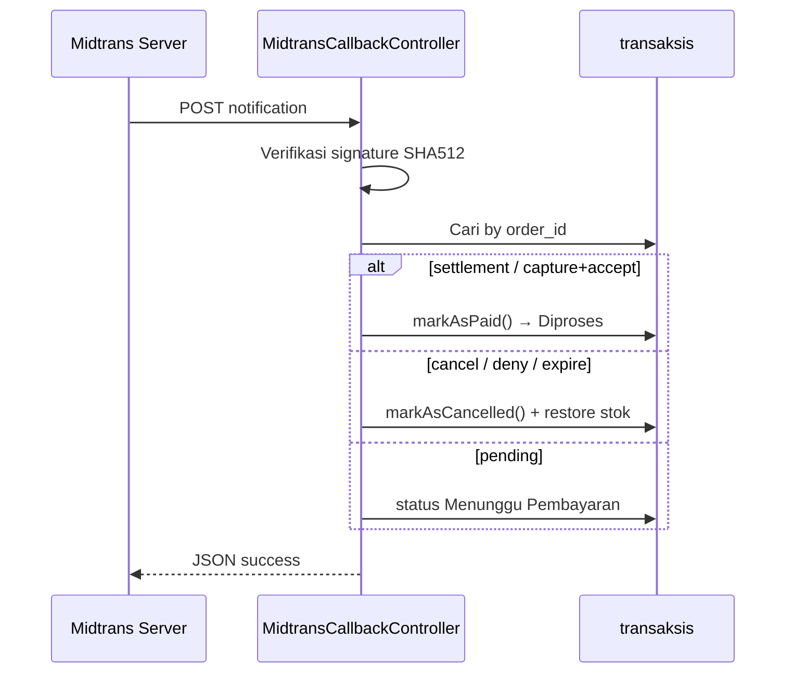

**Signature:** `hash('sha512', orderId + statusCode + grossAmount + serverKey)`

#### Batalkan Pesanan

**Route:** `POST /transaksi/{order_id}/cancel`

Hanya jika status = `Menunggu Pembayaran` → `markAsCancelled()` (kembalikan stok produk).

#### Konfirmasi Selesai (Pelanggan)

**Route:** `POST /transaksi/{order_id}/selesai`

Hanya jika status = `Dikirim` → `markAsSelesai()`:
- Status → `Selesai`
- `akun.poin_reward` += `transaksi.poin`
- Insert `riwayat_poin`
- `products.total_terjual` += jumlah per item

#### Riwayat Pesanan

**Route:** `GET /pesanan-saya?tab=...`

| Tab | Status yang ditampilkan |
|-----|-------------------------|
| `menunggu-pembayaran` | Menunggu Pembayaran, Menunggu Konfirmasi |
| `diproses` | Diproses, Dikirim |
| `riwayat` | Selesai, Dibatalkan |

Saat load: `syncExpiredTransactions()` — pesanan `Menunggu Pembayaran` lewat `batas_pembayaran` otomatis dibatalkan.

#### Detail Transaksi + Tracking

**Route:** `GET /transaksi/{order_id}`

Jika status `Dikirim`/`Selesai` dan ada resi + ekspedisi ≠ `Kurir Lokal`:
1. Cek cache `tracking_{resi}` (1 jam)
2. Panggil **BinderByte API** `GET https://api.binderbyte.com/v1/track`
3. Resi `TESTING123` → data mock (tanpa API)

---

### 6.6 Ulasan Produk / Layanan

**Route:** `POST /transaksi/ulasan`

**Controller:** `Pelanggan\UlasanController`

| Langkah | Detail |
|---------|--------|
| 1 | Input: `id_detailtransaksi`, `type` (produk/layanan), `rating` 1-5, `komentar` |
| 2 | Load detail transaksi → transaksi harus `Selesai` |
| 3 | Cegah duplikasi ulasan per detail + user |
| 4 | Insert `ulasan` |

Admin dapat membalas via modul admin transaksi.

---

### 6.7 Sistem Reward (Pelanggan)

**Route:** `/reward`, `/reward/saya`, `/reward/{id}`, `POST /reward/{id}/claim`

**Controller:** `Pelanggan\RewardController`

#### Klaim Reward

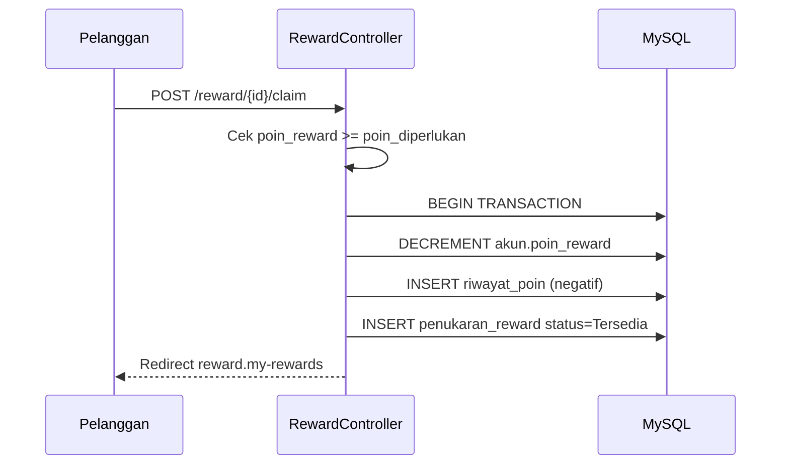

| Field penukaran | Nilai |
|----------------|-------|
| `batas_berlaku` | now + `durasi_reward` hari |
| `status_reward` | `Tersedia` → `Digunakan` (saat checkout) / `Kedaluwarsa` |

#### Pakai Reward di Checkout

Pada `store` checkout produk: jika `id_penukaran_reward` valid dan `grandTotal >= minimal_pembelian` → potong `diskon`, ubah status penukaran ke `Digunakan`.

#### Riwayat Reward Saya

Auto-expire reward `Tersedia` yang melewati `batas_berlaku` → status `Kedaluwarsa`.

---

## 7. Fitur Admin

Semua route prefix dengan middleware `auth` + `role:admin`, name prefix `admin.`.

---

### 7.1 Dashboard Admin

**Route:** `GET /dashboard` → view statis `admin.dashboard`

Admin yang membuka `/` saat sudah login diarahkan ke sini dari landing.

---

### 7.2 Kelola Produk

**Route:** Resource `kelola-produk` → `Admin\ProductController`

| Aksi | Route Name | DB / File |
|------|------------|-----------|
| Index | `admin.produk.index` | List + filter kategori, sort, soft delete tab |
| Create/Store | `admin.produk.create/store` | Upload max 4 foto → `public/uploads/produk/` |
| Edit/Update | `admin.produk.edit/update` | Update row `products` |
| Destroy | `admin.produk.destroy` | `is_delete = true` (soft delete) |
| Restore | via update `restore` flag | `is_delete = false` |

**Tabel `products`:** slug auto, kategori, berat (gram), stok, `total_terjual`, foto JSON array.

---

### 7.3 Kelola Layanan

**Route:** Resource `kelola-layanan` → `Admin\LayananController`

Struktur sama produk: CRUD, upload ke `public/uploads/layanan/`, soft delete/restore pada `layanan`.

---

### 7.4 Kelola Transaksi

**Route:** `/kelola-transaksi` → `Admin\TransaksiController`

#### Listing & Detail

Mirip pelanggan (tab status), tanpa filter `user_id`. Detail termasuk data pelanggan + tracking BinderByte.

#### Update Status Manual

**Route:** `POST /kelola-transaksi/{order_id}/status`

Transisi yang diizinkan:

| Status Saat Ini | Bisa ke |
|-----------------|---------|
| Menunggu Konfirmasi | Diproses, Dibatalkan |
| Menunggu Pembayaran | Dibatalkan |
| Diproses | Dikirim |
| Dikirim | Selesai |

**Aturan khusus:** Status `Dikirim` manual (non-COD) hanya untuk kecamatan Patrang, Sumbersari, Kaliwates.

Jika target `Selesai` → panggil `markAsSelesai()` (sama efek poin & total_terjual).

#### Input Resi

**Route:** `POST /kelola-transaksi/{order_id}/resi`

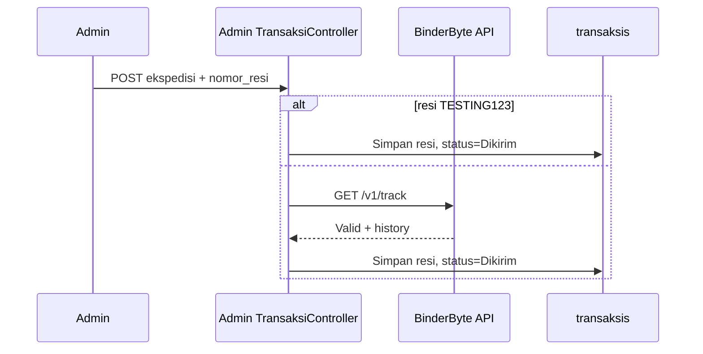

#### Balas Ulasan

**Route:** `POST /kelola-transaksi/ulasan/{id}/reply`

Update `ulasan.balasan` + `tanggal_balasan`.

---

### 7.5 Kelola Reward

**Route:** Resource `kelola-reward` + customers → `Admin\RewardController`

| Fitur | Alur |
|-------|------|
| CRUD reward | `rewards` — nama, diskon, minimal_pembelian, poin_diperlukan, durasi_reward |
| Soft delete / restore | `is_delete` flag |
| Daftar pelanggan | `akun` WHERE role=pelanggan |
| Detail pelanggan | Poin, riwayat poin, penukaran reward (aktif/dipakai/expired) |

---

## 8. API & Integrasi Eksternal

### 8.1 Midtrans (Pembayaran)

| Aspek | Detail |
|-------|--------|
| Config | `MIDTRANS_SERVER_KEY`, `MIDTRANS_CLIENT_KEY`, `MIDTRANS_IS_PRODUCTION` |
| Charge | `Midtrans\CoreApi::charge()` saat checkout online |
| Callback | `POST /api/midtrans/callback` |
| CSRF | Di-exclude di `bootstrap/app.php` |

**Alur uang:**

```
Pelanggan bayar di Midtrans
    → Midtrans kirim notification POST
    → MidtransCallbackController
    → Update status transaksi
    → Pelanggan polling / refresh halaman
```

### 8.2 BinderByte (Tracking Resi)

| Aspek | Detail |
|-------|--------|
| Config | `BINDERBYTE_API_KEY` di `.env` |
| Endpoint | `GET https://api.binderbyte.com/v1/track` |
| Parameter | `api_key`, `courier`, `awb` |
| Cache | 1 jam per nomor resi |
| Dipakai | Admin input resi, tampilan detail transaksi (admin & pelanggan) |

### 8.3 Wilayah API

Lihat [5.4 Data Wilayah](#54-data-wilayah-dropdown). Tidak memanggil API eksternal — data lokal di MySQL (seeder).

---

## 9. Email

| Trigger | Class | Template | Isi |
|---------|-------|----------|-----|
| Lupa password OTP | `OtpMail` | `resources/views/emails/otp.blade.php` | Kode 6 digit, subject "Kode Verifikasi Anda" |

**Konfigurasi:** `config/mail.php` + variabel `.env` (`MAIL_MAILER`, `MAIL_HOST`, `MAIL_PORT`, `MAIL_USERNAME`, `MAIL_PASSWORD`, dll).

**Alur pengiriman:**

```
ForgotPasswordController@sendOtp
    → Mail::to($email)->send(new OtpMail($otp))
    → SMTP server
    → Inbox pengguna
```

Email **tidak** dipakai untuk notifikasi transaksi — hanya OTP reset password.

---

## 10. Scheduler (Background)

Didefinisikan di `routes/console.php`, dijalankan via `php artisan schedule:run` (cron setiap menit).

| Job | Frekuensi | Aksi |
|-----|-----------|------|
| Expired payment | `everyMinute` | Transaksi `Menunggu Pembayaran` lewat `batas_pembayaran` → `markAsCancelled()` |
| Expired reward | `everyMinute` | `penukaran_reward` status `Tersedia` lewat `batas_berlaku` → `Kedaluwarsa` |

**Catatan:** Controller pelanggan juga menjalankan sinkronisasi serupa saat membuka halaman transaksi (defense in depth).

---

## 11. Diagram Status Transaksi

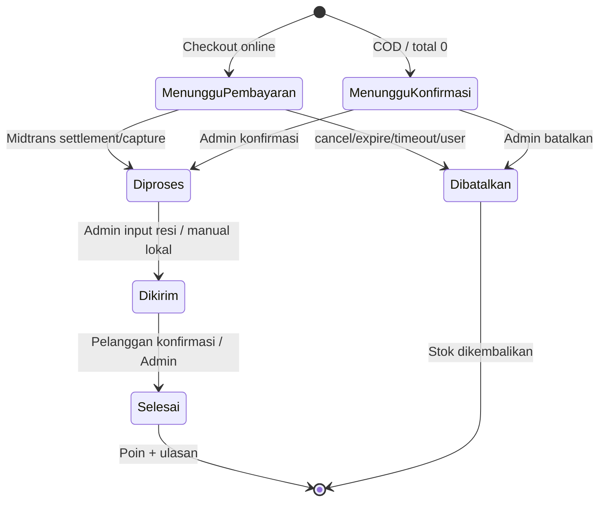

### Poin reward setelah selesai

| Jenis transaksi | Rumus poin |
|-----------------|------------|
| Produk | `floor(total_setelah_diskon / 10000)` |
| Layanan | `floor(harga_layanan / 50000)` |

Poin ditambahkan ke `akun.poin_reward` saat status menjadi `Selesai` (bukan saat checkout).

---

## 12. Referensi Route

### Publik & Guest

| Method | URI | Name | Controller |
|--------|-----|------|------------|
| GET | `/` | landing | Closure |
| GET | `/produk` | produk.index | ProductController@index |
| GET | `/produk/{slug}` | produk.show | ProductController@show |
| GET | `/layanan` | layanan.index | LayananController@index |
| GET | `/layanan/{slug}` | layanan.show | LayananController@show |
| GET | `/register` | register | RegisterController |
| POST | `/register` | — | RegisterController@register |
| GET | `/login` | login | LoginController |
| POST | `/login` | — | LoginController@login |
| GET | `/forgot-password` | password.request | ForgotPasswordController |
| POST | `/forgot-password/send-otp` | — | ForgotPasswordController@sendOtp |
| POST | `/forgot-password/verify-otp` | — | ForgotPasswordController@verifyOtp |
| GET | `/reset-password` | password.reset | ForgotPasswordController |
| POST | `/reset-password` | password.update | ForgotPasswordController |

### Pelanggan (auth + role:pelanggan)

| Method | URI | Name |
|--------|-----|------|
| GET | `/keranjang` | cart.index |
| POST | `/keranjang/tambah` | cart.store |
| PATCH | `/keranjang/update/{cart}` | cart.update |
| DELETE | `/keranjang/hapus/{cart}` | cart.destroy |
| GET | `/checkout` | checkout.produk.index |
| POST | `/checkout/store` | checkout.produk.store |
| GET | `/checkout-layanan` | checkout.layanan.index |
| POST | `/checkout-layanan/store` | checkout.layanan.store |
| GET | `/cek-ongkir` | cek-ongkir |
| GET | `/pesanan-saya` | transaksi.history |
| GET | `/transaksi/{order_id}` | transaksi.show |
| GET | `/pembayaran/{order_id}` | transaksi.pembayaran |
| GET | `/transaksi/{order_id}/status-check` | transaksi.status-check |
| POST | `/transaksi/{order_id}/cancel` | transaksi.cancel |
| POST | `/transaksi/{order_id}/selesai` | transaksi.selesai |
| POST | `/transaksi/ulasan` | ulasan.store |
| GET | `/reward` | reward.index |
| GET | `/reward/saya` | reward.my-rewards |
| GET | `/reward/{id}` | reward.show |
| POST | `/reward/{id}/claim` | reward.claim |

### Admin (auth + role:admin)

| Method | URI | Name |
|--------|-----|------|
| GET | `/dashboard` | admin.dashboard |
| Resource | `/kelola-produk` | admin.produk.* |
| Resource | `/kelola-layanan` | admin.layanan.* |
| GET | `/kelola-transaksi` | admin.transaksi.index |
| GET | `/kelola-transaksi/{order_id}` | admin.transaksi.show |
| POST | `/kelola-transaksi/{order_id}/status` | admin.transaksi.status |
| POST | `/kelola-transaksi/{order_id}/resi` | admin.transaksi.resi |
| POST | `/kelola-transaksi/ulasan/{id}/reply` | admin.transaksi.reply-ulasan |
| Resource | `/kelola-reward` | admin.reward.* |
| GET | `/kelola-reward/customers` | admin.reward.customers |
| GET | `/kelola-reward/customers/{id}` | admin.reward.customer-show |

### Auth Umum + API

| Method | URI | Name |
|--------|-----|------|
| GET | `/profile` | profile |
| PUT | `/profile/update` | profile.update |
| PUT | `/profile/password` | profile.password.update |
| POST | `/logout` | logout |
| POST | `/api/midtrans/callback` | — (MidtransCallbackController) |

---

## Lampiran: Struktur Controller

```text
app/Http/Controllers/
├── Auth/
│   ├── LoginController.php
│   ├── RegisterController.php
│   └── ForgotPasswordController.php
├── Admin/
│   ├── ProductController.php
│   ├── LayananController.php
│   ├── TransaksiController.php
│   └── RewardController.php
├── Pelanggan/
│   ├── KeranjangController.php
│   ├── TransaksiController.php
│   ├── UlasanController.php
│   └── RewardController.php
├── Api/
│   └── MidtransCallbackController.php
├── ProductController.php      (publik)
├── LayananController.php      (publik)
├── ProfileController.php
└── WilayahController.php
```

---

## Lampiran: Variabel Environment Penting

| Variabel | Digunakan untuk |
|----------|-----------------|
| `DB_*` | Koneksi MySQL |
| `MAIL_*` | Pengiriman OTP |
| `MIDTRANS_SERVER_KEY` | Charge & verifikasi callback |
| `MIDTRANS_CLIENT_KEY` | Frontend Snap (jika dipakai) |
| `MIDTRANS_IS_PRODUCTION` | Mode sandbox/production |
| `BINDERBYTE_API_KEY` | Validasi & tracking resi |

---

*Dokumen ini dibuat berdasarkan kode sumber di repository HydroMart 2. Untuk cara menjalankan aplikasi di Windows, lihat [RUNNING_GUIDE_WINDOWS.md](RUNNING_GUIDE_WINDOWS.md).*
